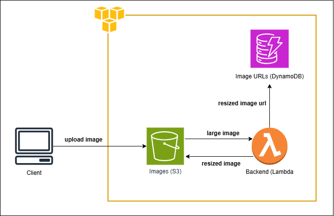

<!-- TABLE OF CONTENTS -->
<details>
  <summary>Table of Contents</summary>
  <ol>
    <li>
      <a href="#about-the-project">About The Project</a>
      <ul>
        <li><a href="#built-with">Built With</a></li>
      </ul>
    </li>
    <li>
      <a href="#getting-started">Getting Started</a>
      <ul>
        <li><a href="#prerequisites">Prerequisites</a></li>
      </ul>
    </li>
    <li><a href="#project-folders">Project Folders</a></li>
    <ul>
        <li><a href="#main-project-directory">Main Project Directory</a></li>
      <li><a href="#lambda">Lambda</a></li>
      <li><a href="#front-end">Front-End</a></li>
      </ul>
 
  </ol>
</details>


<!-- ABOUT THE PROJECT -->
## About The Project

This is a serverless application that sends automated emails to its subscribers using AWS architecture integrated with a front-end subscription form. The form collects information and calls API's to AWS to store information in DynamoDB. Once the details are stored, the application pulls content from S3 and triggers lambdas to call API's to form the email. The owner of the site is also notied using SNS whenever someone signs up. Once the content is pulled from the bucket, the lambdas also fetch the emails of the subscribers from the database and sends it to a third party app called SendGrid. This helps send the mails that are scheduled using event bridge.




### Built With

* Python 3.9
* AWS Lambda, DynamoDB, S3 and SAM
* YAML

### Prerequisites

Two key things required for this project are :

* AWS CLI (set it up easily with this guide at https://docs.aws.amazon.com/polly/latest/dg/setup-aws-cli.html

<!-- GETTING STARTED -->
### Getting Started

After setting up the AWS CLI you can use this command inside whichever directory you want to start the project

* Initialise a SAM Project
  ```sh
  sam init
  ```

Set it up with the language you want to work with and choose the 'Hello World' example project as a base. You can follow this guide here at  https://docs.aws.amazon.com/serverless-application-model/latest/developerguide/serverless-getting-started-hello-world.html


## Project Folders

There are three key folders to this project. The main project directory, lambda and front-end. The main project directory has the configuration and SAM template to deploy the architecture. The /lambda folder has the lambda functions and necessary dependancies and the /front-end has the files related to front and and python-flask environment.


### Main Project Directory

You can create your template in this folder as well as where the configuration file with automaticallly appear. The quotes.json folder is also provided here, this has to be put into the s3 bucket once the intial architecture is launched. Lauch the AWS CLI and from the project directory you can use these commands after the intial setup using the same deploy --guided command from the guide.

* Build the project
  ```sh
  sam build
  ```
 * Deploy the architecture
  ```sh
  sam deploy
  ```
  
  ### Lambda

Over here i have added the python file containing all the lambda functions required to run the application.
